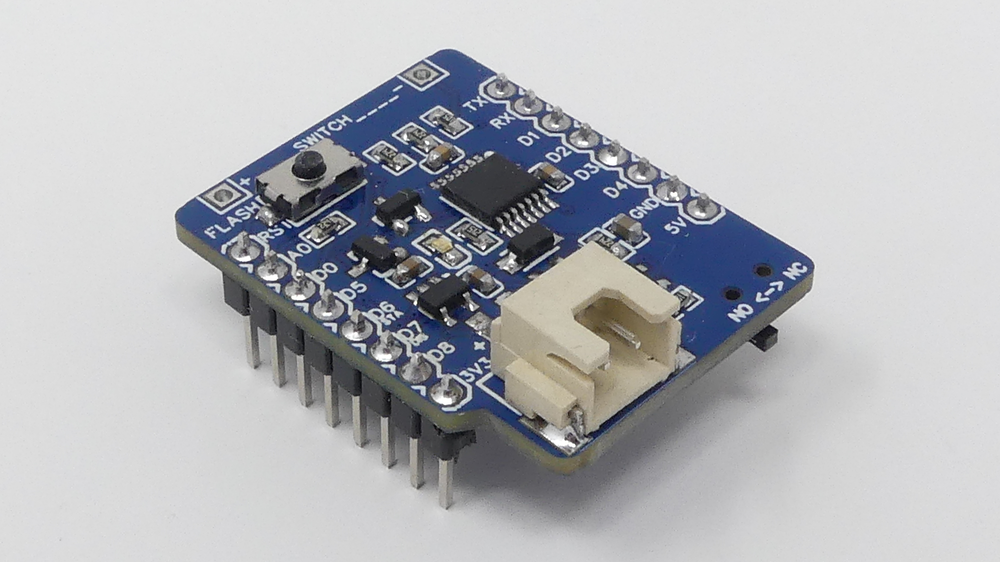

# About the MicroWakeupper Wemos D1 Mini Shield

**What is it?**

You need the MicroWakeupper if you want to wakeup or power on your ESP/Wemos due to an external event (e.g. a switch, button or PIR-sensor). As soon as there is an external event the MicroWakeupper wakes up your ESP/Wemos from deep sleep or just turns it on. Pin A0 is connected - can be disconnected - to V-Batt for measuring the current battery voltage.
The MicroWakeupper and your ESP/Wemos is powered by a standard (protected) LiPo battery (XH-Header). The internal LDO (AP2112K) will take care about the 3.3V voltage supply.

**Why did you make it?**

The MicroWakeupper will run your projects with a battery for years. Your ESP/Wemos will only wakeup or turn on (and consume current) if the connected switch, button or PIR sensor was toggled/triggered. During the rest of the time the ESP is in deep sleep mode or (optionally) completely off.

**What makes it special?**

The MicroWakeupper is the plug and play solution if you want to add a button, switch or PIR sensor to your project. The board supports two switching modes for normally open or normally closed behaviour. It also takes care about retriggering and button debouncing.

**About ESP.DeepSleep**
The ESP8266 supports different deep sleep modes to reduce power consumption to a minimum.
For more information check this doc:
 ESP8266 -> https://www.espressif.com/sites/default/files/9b-esp8266-low_power_solutions_en_0.pdf

If you google for "ESP deep sleep" there already some really cool examples and projects available,
like this one:

 https://www.losant.com/blog/making-the-esp8266-low-powered-with-deep-sleep

Definitely recommended (like all his other videos from Andreas Spiess) this one: https://youtu.be/IYuYTfO6iOs

# The latest board revision is available on tindie:
https://www.tindie.com/stores/moreiolabs/

---
# You'll always find the latest schematic, BOM and Gerber files on GitHub:

https://github.com/tstoegi/MicroWakeupper/pcb

---

That's it!

Have fun and hopefully your project will run for years now ;-)

#Special thanks to @davedarko!

Created on December 13th 2018 by Tobias Stöger (@tstoegi)  
Updated to Rev.3 on January 7th 2019 by Tobias Stöger
Updated to Rev.6 on May 20th 2021 by Tobias Stöger
